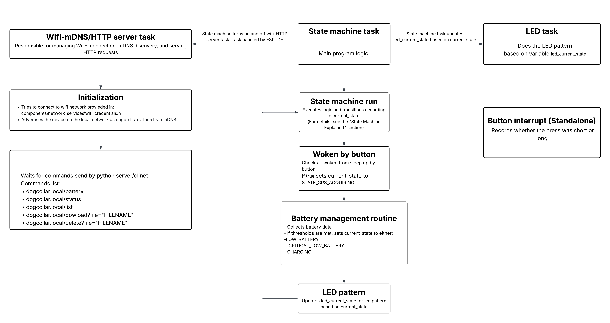
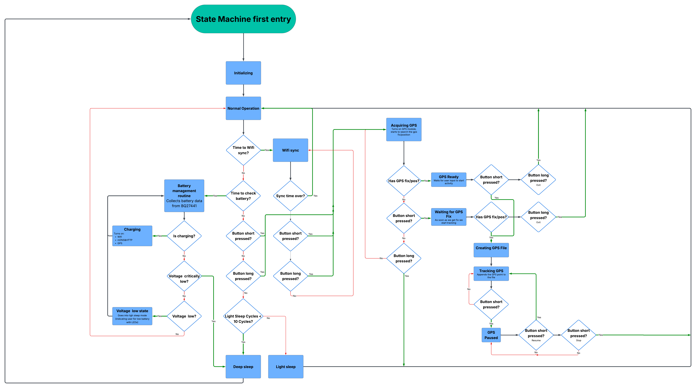

# Dog Collar GPS Tracker

A complete ESP32-C3 based dog collar GPS tracker project with:

- Custum designed PCB with EPS32-C3-WROOM-02 proccesor and L96-M33 GPS module
- Embedded source code for ESP32-C3 in ESP-IDF framework using C and FreeRTOS
- Python client/server source code for automatic file download, GPX conversion, and Strava upload

---

## Idea

I am a passionate trail/ultra runner and my dog, Kali, often joins me on the runs. While she runs beside me in busy areas, she roams freely on trails. This led to a joking thought: if I ran 30km, she must have run like 50km or more. This sparked the idea for a custom GPS tracker for her, functioning like my own watch and uploading activities to Strava, so I could finally see just how much further she really runs.

## Implementation

I wanted to challenge myself, so I decided to add in as many features and protocols as I could.  
The idea wasn’t just to make it work, but to also get some experience with full project development — from hardware and to firmware.

### PCB Design

I planned and designed a custom PCB from scratch where I integrated the following components:

- **ESP32-C3-WROOM-02** — main MCU (Wi-Fi, UART, I2C, SPI)
- **L96-M33 GPS module** — UART 
- **BQ27441 battery monitor** — I2C
- **PCF8574 GPIO expander** — I2C
- **W25Q128JV NOR flash chip** — SPI
- **Button, RGB LED, Li-ion battery and charging circuitry**


To make it more challenging (and cheaper), I decided to go with a 2-layer board, where the back layer is 95% copper pour tied to GND.  
Only a few traces are routed there due to tight spacing and EMI considerations.

The schematic and PCB layout were designed in **Altium Designer**, and I ordered the boards from **JLCPCB**.

### PCB Photos


Here’s how the finished board looks:

<div align="center">
  
  
</div>

<p align="center">
  <em>Left: Front view &nbsp;&nbsp;&nbsp;&nbsp;&nbsp; Right: Back view with mostly GND plane</em>
</p>

---


## Result

**See Kali’s real GPS activity on Strava:** 
[Kali's Strava account](https://www.strava.com/athletes/179438346?num_entries=10)  
And please give her some Kudos :)


---


# Dog Collar Tracker

## Embedded Firmware Features (ESP32-C3 in ESP-IDF)

- **GPS Tracking**  
  Logs GPS data to CSV files on external SPI flash using file system LittleFS.

- **Battery Monitoring**  
  Tracks battery voltage, current, state of charge (SoC), and temperature.

- **Wi-Fi & mDNS**  
  Connects to Wi-Fi and advertises the device on the local network as `dogcollar.local` via mDNS.

- **HTTP Server**  
  Hosts a simple web interface to list, download, and delete recorded files. Also to check the battery and status data.

- **LED Indicators**  
  Uses GPIO expander for RGB LED feedback for difrent states (charging, tracking, error, etc.).

- **Button Controls**  
  Physical button to control state transitions: start/stop tracking, pause, etc.
  The button can also wake the ESP32 from ligh & deep sleep.

- **Power Management**  
  Light & deep sleep modes to save battery

---

## Python Server/Client

- **Device Discovery**  
  Continuously attempts to connect to the ESP32 device on the local network via mDNS (`dogcollar.local`) until successful.

- **File Handling**  
  Downloads new activity file (if not alredy dowlaoded) and converts it to GPX format.

- **Strava Integration**  
  Uploads new GPX files to Strava account.

- **Local File Management**  
  Stores and organizes raw (CSV) and converted (GPX) files in local directories.

---

## SYSTEM OVERVIEW FLOWCHART

This flowchart provides a **high-level overview of the system architecture** running on the **ESP32**, also known as the **DOG COLLAR**.  
The system is structured around three main FreeRTOS tasks and one interrupt:

- **Wi-Fi / mDNS / HTTP Server Task** – Handles wireless communication and web server functionality
- **State Machine Task** – Manages core logic and system behavior
- **LED Task** – Controls status indication via LEDs
- **Button Interrupt (Independent)** – Monitors button input and classifies presses as short or long; runs outside of the main tasks

> For detailed state transitions and internal logic, see the [State Machine Flowchart](#state-machine-flowchart) 


---

## STATE MACHINE FLOWCHART

This flowchart explains the **core state machine logic** that controls the behavior of the ESP32.  
> **Note:** If any component fails, the system transitions to the **Error** state and remains there.  
This transition is not shown in the flowchart to avoid cluttering.



## Hardware

- ESP32-C3-WROOM-02
- L96-M33 GPS module      (UART)
- BQ27441 battery monitor (I2C)
- PCF8574 GPIO expander   (I2C)
- W25Q128JV  NOR Flash    (SPI)
- LEDs, button, battery, and supporting circuitry

See `/hardware` for schematics and datasheets.

---

## Directory Structure

```
embedded_firmware/
  components/
    battery_monitor/         # Battery monitoring driver
    button_interupt/         # Button interrupt handler
    external_flash/          # SPI flash driver
    file_system_littlefs/    # LittleFS integration
    gpio_expander/           # PCF8574 GPIO expander
    gps_l96/                 # GPS L96 driver
    network_services/        # Wi-Fi, mDNS, HTTP server
  dog_collar/
    dog_collar_state_machine/  # Main state machine and LED management
  drivers/                   # I2C, UART, LittleFS low-level drivers
  src/
    main.c                   # FreeRTOS entry point
  managed_components/
    espressif__mdns/         # ESP-IDF mDNS component
python_server/
  src/
    dogcollar_client.py      # Main client logic
    local_storage_manager.py # File management
    gpx_converter.py         # CSV to GPX conversion
    strava_uploader.py       # Strava API integration
hardware/
  ...                        # Schematics, datasheets, PDFs
```


---

## Getting Started (PlatformIO)

### Prerequisites

- [PlatformIO](https://platformio.org/) installed (VS Code extension or standalone)
- ESP32 board (e.g., ESP32-C3-DevKitC-02)
- All hardware connected as described in the hardware section

### 1. Clone the Repository

```sh
git clone https://github.com/yourusername/Dog-Collar-GPS.git
cd Dog-Collar-GPS/embedded_firmware
```

### 2. Configure Wi-Fi Credentials

Edit your Wi-Fi credentials in  
`components/network_services/wifi_credentials.h`:

```c
#define WIFI_CRED_SSID "your_wifi_ssid"
#define WIFI_CRED_PASS "your_wifi_password"
```

### 3. Build and Upload Firmware

- Open the project folder in VS Code.
- Use the PlatformIO sidebar:
  - Click **Build** (checkmark icon).
  - Click **Upload** (right arrow icon).

Or use the CLI:

```sh
pio run
pio run -t upload
```

### 4. Monitor Serial Output

- Use the PlatformIO **Monitor** button, or run:

```sh
pio device monitor
```

### 5. Access the Device

- Web interface: [http://dogcollar.local](http://dogcollar.local)
- Python client: Connects via `dogcollar.local` (see `/python_server`)


- Note:  For Python server setup and Strava integration, see the `/python_server` folder and its README.
---

## Usage

- **Button:**  
  - Short press: Start/stop/pause tracking, depending on state.
  - Long press: Return to idle/normal state.
- **LEDs:**  
  - Indicate charging, tracking, errors, etc.
- **Web Interface:**  
  - List/download/delete activity files.

---


## Potential Improvements & Future Work

- **Efficient Data Storage**  
  Instead of writing CSV files for GPS data on the ESP32, data could be structured in binary format (structs) to reduce the file size. The data would then be decoded on the computer (python server) side, allowing for more efficient storage.

- **Garmin Connect Integration**  
  Add support for uploading activity data directly to Garmin Connect through their API.

- **Real-Time Streaming Mode**  
  Enable a live tracking mode where GPS data is streamed over BLE to a paired device instead of being stored locally or add SIM9650L module for LTE connection.

- **BLE Support**  
  Add Bluetooth Low Energy connectivity for syncing with mobile apps or wearables without Wi-Fi.

- **Multiple Wi-Fi Networks**  
   Support storing and cycling through multiple Wi-Fi SSID/password networks.

- **Advanced Web Interface**  
  Expand the built-in HTTP server interface to allow:
  - Configuration of logging intervals and power settings
  - Manual file download and deletion
  - Network setup (SSID/password input)

- **Encrypted Storage or Upload**  
  Secure activity data using encryption before storing or uploading to cloud services.

- **Multi-Device Sync**  
  Allow multiple collars/devices to sync to a single server.


## License

Copyright © 2025 Tomaz Miklavcic  
Use this code for whatever you want. No restrictions, no warranty. Attribution appreciated but not required.
